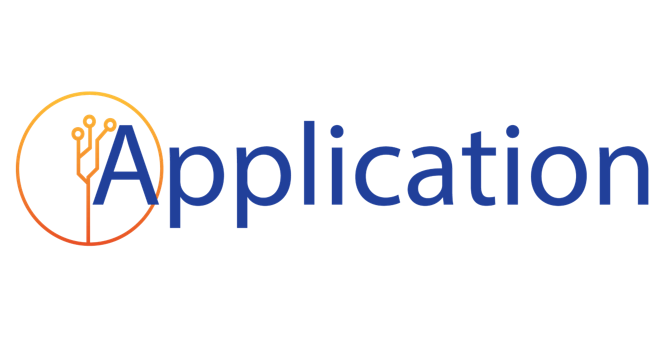
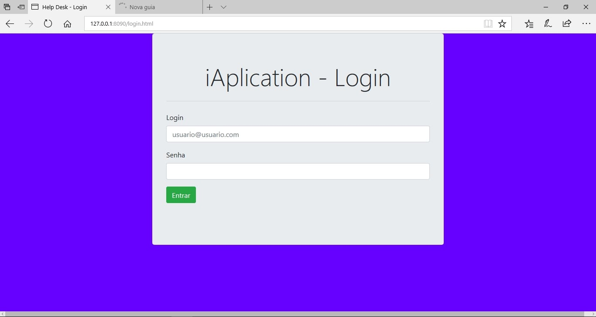
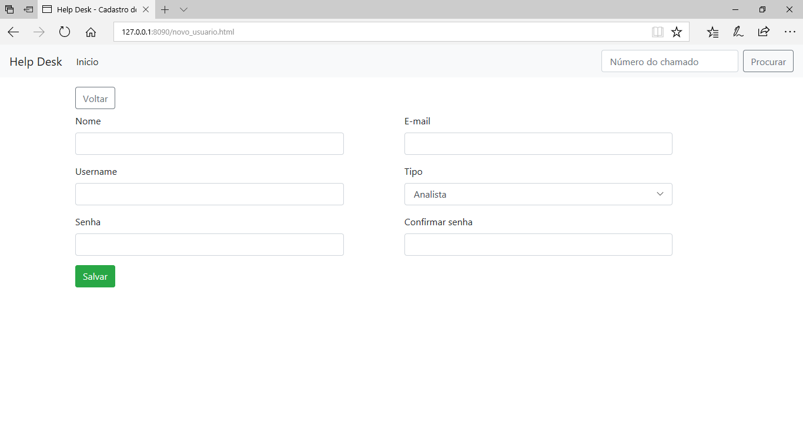
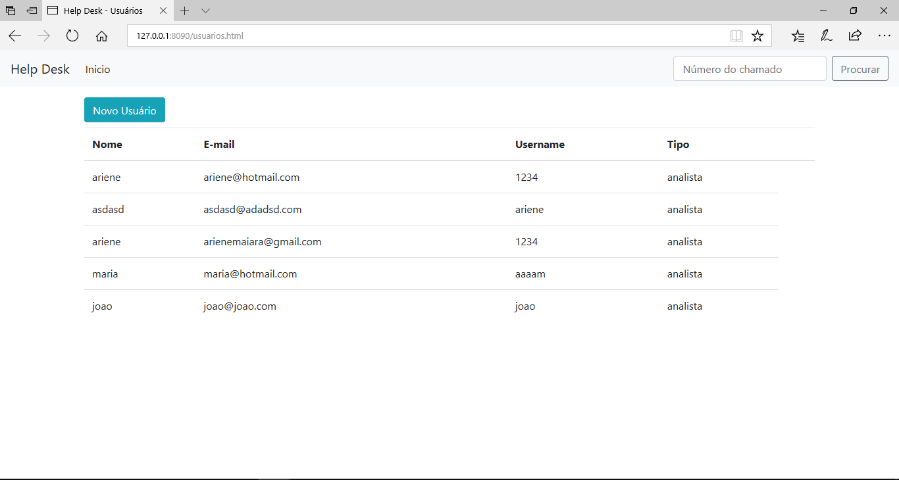
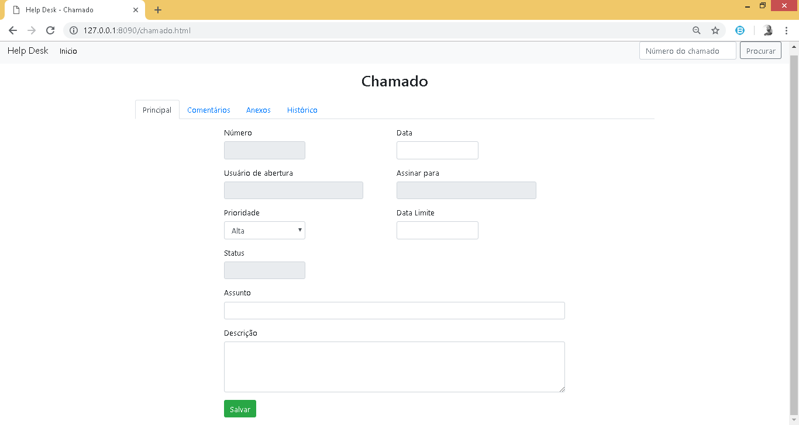

# O PROJETO 

Criar uma aplicação para Gerenciamento de chamados de Help-Desk, com intuído de colocar em pratica todo contudo aprendido na disciplina Engenharia de Software e Laboratórios de Desenvolvimento III.

### Grupo
#### Ariene Maiara
#### Daniel Willians
#### Thais Bitencourt

## Fluxograma

## Telas
### Login

### Cadastro de Usuários

### Lista Usuários

### Cadastro de Chamado

### Listar Chamados

### Mais sobre o projeto  [Documentação](Documentação.md) página.
