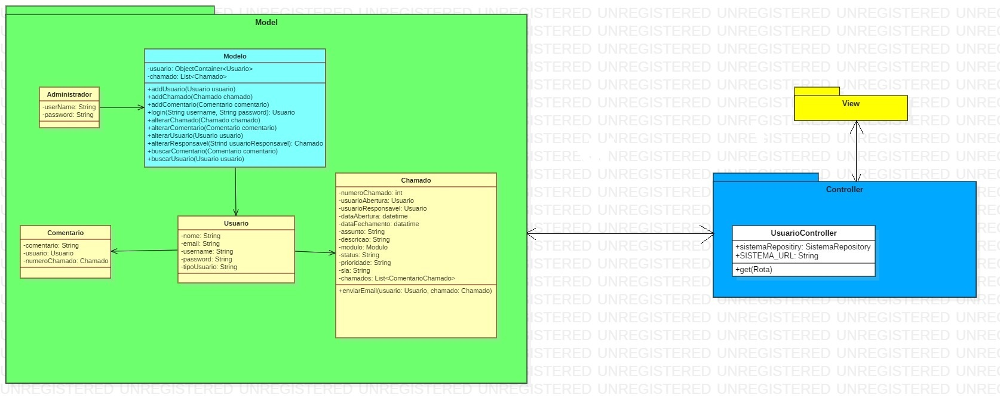

# O PROJETO
Criar uma aplicação para Gerenciamento de chamados de Help-Desk, com intuído de colocar em pratica todo contudo aprendido na disciplina Engenharia de Software.

## Fluxograma

## Mais sobre o projeto  [Documentação](Documentação.md) página.
